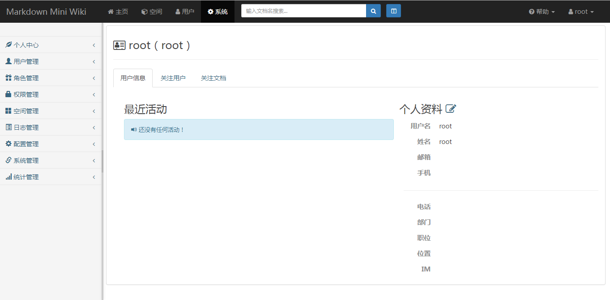
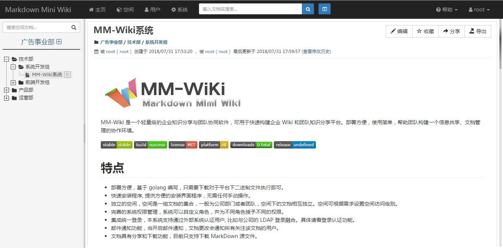
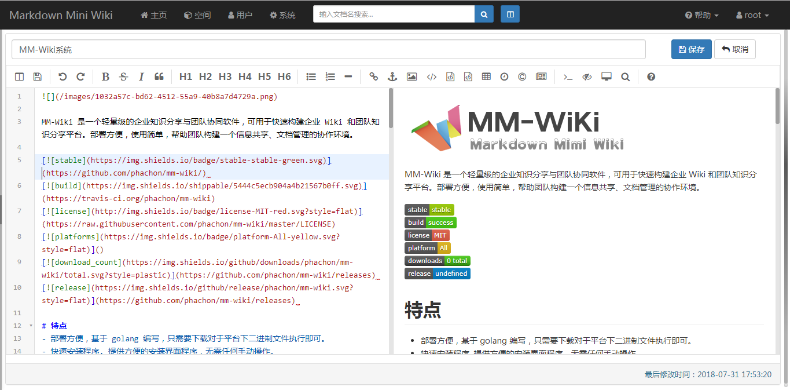
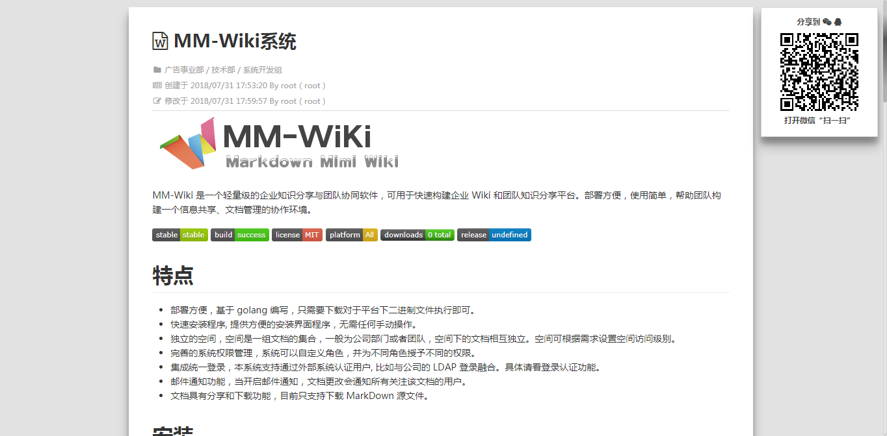

MM-Wiki 是一个轻量级的企业知识分享与团队协同软件，可用于快速构建企业 Wiki 和团队知识分享平台。部署方便，使用简单，帮助团队构建一个信息共享、文档管理的协作环境。

# 特点
- 部署方便，基于 golang 编写，只需要下载对于平台下二进制文件执行即可。
- 快速安装程序, 提供方便的安装界面程序，无需任何手动操作。
- 独立的空间，空间是一组文档的集合，一般为公司部门或者团队，空间下的文档相互独立。空间可根据需求设置空间访问级别。
- 支持 markdown 语法写作，支持附件上传。
- 完善的系统权限管理，系统可以自定义角色，并为不同角色授予不同的权限。
- 集成统一登录，本系统支持通过外部系统认证用户, 比如与公司的 LDAP 登录融合。具体请看登录认证功能。
- 邮件通知功能，当开启邮件通知，文档更改会通知所有关注该文档的用户。
- 文档具有分享和下载功能，目前只支持下载 MarkDown 源文件。
- 支持文档全文搜索

# 安装
## 1. 安装

- Docker 部署
    ```
    # 数据库准备
    # 导入docs/databases/data.sql和docs/databases/table.sql（注：需取消注释data.sql中第一条管理用户插入语句）

    # 本地构建最新代码
    # 构建项目镜像
    # docker build -t mm-wiki-image .
    # 新增配置文件，数据存放目录以及Mysql数据库配置在mm-wiki.conf配置文件中设置
    # 挂载配置文件及数据存放目录，启动端口为8080
    # docker run -d -p 8080:8081 -v /data/mm-wiki/conf/:/opt/mm-wiki/conf/ -v /data/mm-wiki/data/:/data/mm-wiki/data/ --name mm-wiki mm-wiki-image
    ```
## 2. 如果需要，可用 nginx 配置反向代理
```
upstream frontends {
    server 127.0.0.1:8088; # MM-Wiki 监听的ip:port
}
server {
    listen      80;
    server_name wiki.intra.xxxxx.com www.wiki.intra.xxxxx.com;
    location / {
        proxy_pass_header Server;
        proxy_set_header Host $http_host;
        proxy_redirect off;
        proxy_set_header X-Real-IP $remote_addr;
        proxy_set_header X-Scheme $scheme;
        proxy_pass http://frontends;
    }
    # 静态资源交由nginx管理
    location /static {
        root        /www/mm-wiki; # MM-Wiki 的根目录
        expires     1d;
        add_header  Cache-Control public;
        access_log  off;
    }
}
```

# 系统预览

### 1 安装

### 2 登录

### 3 系统

### 4 空间文档

### 5 编辑文档

### 6 文档分享


# 使用的一些插件

MM-Wiki 是站在巨人的肩膀上开发的一款软件，是因为系统中使用了非常多优秀的插件，非常感谢这些插件的作者们：

- [bootstrap](https://github.com/twbs/bootstrap)
- [awesome-bootstrap-checkbox](https://github.com/flatlogic/awesome-bootstrap-checkbox)
- [bootstrap-iconpicker](https://victor-valencia.github.com/bootstrap-iconpicker)
- [bootstrap-select](http://silviomoreto.github.io/bootstrap-select)
- [bootstrap-switch](https://bttstrp.github.io/bootstrap-switch)
- [bootstrap-tagsinput](https://github.com/bootstrap-tagsinput/bootstrap-tagsinput)
- [editor.md](https://github.com/pandao/editor.md)
- [layout](http://jquery-dev.com)
- [layer](http://layer.layui.com/)
- [metisMenu](https://github.com/onokumus/metisMenu)
- [morris](http://morrisjs.github.com/morris.js/)
- [popover](https://github.com/sandywalker/webui-popover)
- [scrollup](http://markgoodyear.com/labs/scrollup/)
- [zTreev3](http://treejs.cn/)

# 二次开发

环境要求：go 1.8
```
$ git clone https://github.com/dombine/mm-wiki.git
$ cd mm-wiki
$ go build ./
```

Create By dombine
